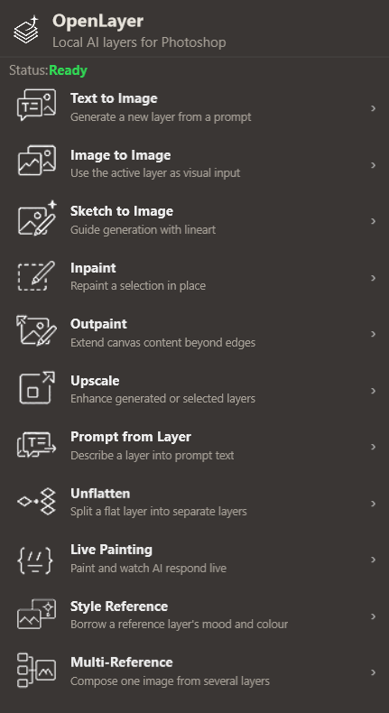
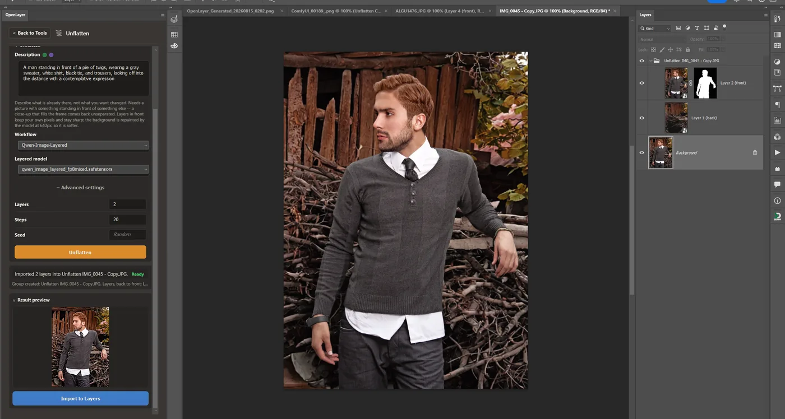
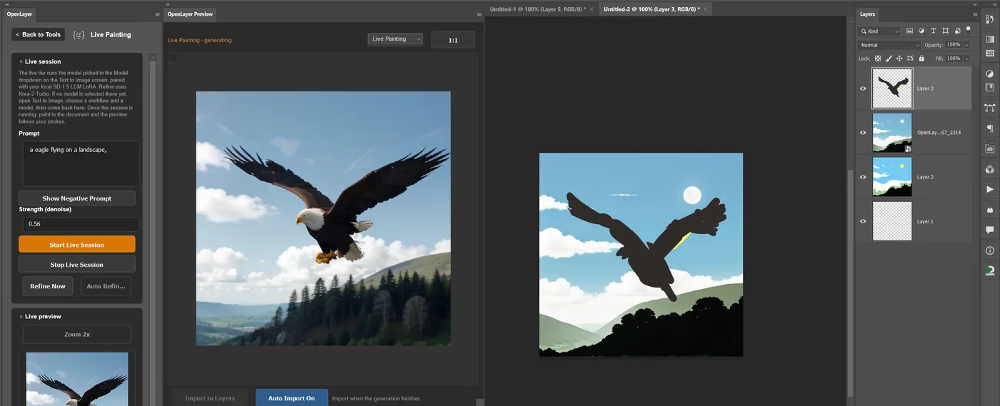
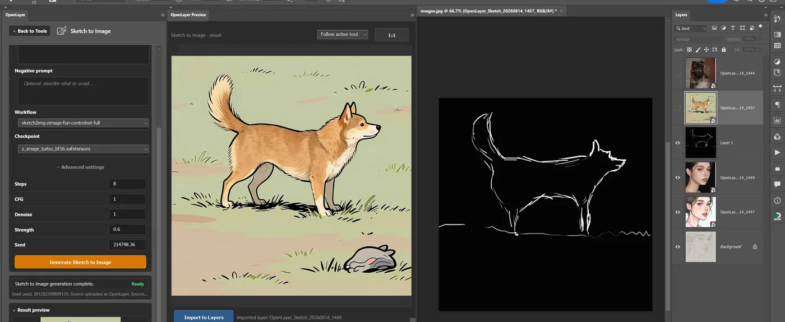
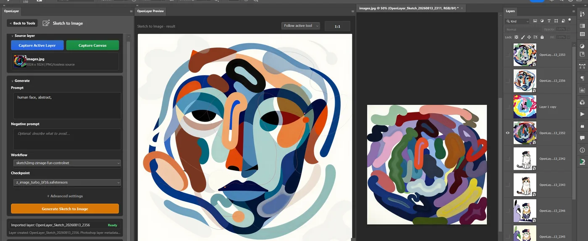
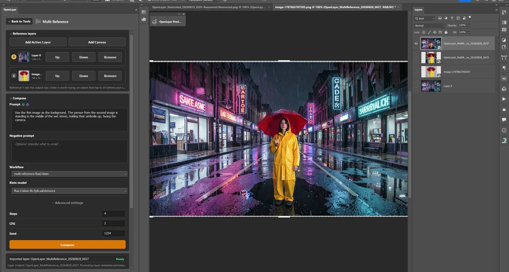
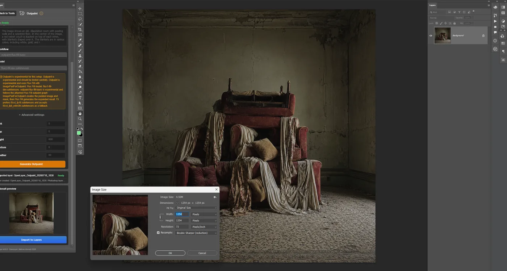

<p align="center">
  
</p>

<h1 align="center">OpenLayer</h1>

<p align="center">
  <b>The free, open-source Photoshop plugin for ComfyUI.</b><br>
  Local AI layers, inside Photoshop.
</p>

<p align="center">
  
  
  
  
  <br>
  <a href="https://github.com/MehranMarxian/OpenLayer/releases/latest/download/openlayer-latest.ccx"><b>Download for Photoshop (.ccx)</b></a>
  ·
  <a href="https://mehran-ahmadi.com/OpenLayer/">Website</a>
  ·
  <a href="docs/getting-started.md">Getting started</a>
  ·
  <a href="https://github.com/MehranMarxian/OpenLayer/discussions">Discussions</a>
</p>

<table>
<tr>
<td width="34%" valign="top">
  
</td>
<td valign="top">

- **Free, with no subscription.** No credits, no metering, no account, no upload quota.
- **Nothing leaves your computer.** ComfyUI runs on your own machine, on your own models.
- **Results arrive as real Photoshop layers** — named, positioned, and editable. Not a flattened
  PNG you paste in and hope for.
- **Eleven generation tools**, from text-to-image to splitting a flat picture back into layers.

**You need:** Photoshop 2024+ · a local [ComfyUI](https://github.com/comfyanonymous/ComfyUI)
server · a GPU with 8 GB VRAM or more (12 GB is what this project targets) · Windows, verified —
[macOS is untested](#installation).

> **Alpha.** `v0.20.0-alpha` is a public testing checkpoint, not production software. It is
> stable enough to work with, and honest about where it stops — see [what works and what does
> not](docs/known-limitations.md).

</td>
</tr>
</table>

---

## The tools

Every tool reads from your open document and writes back to it as a layer. Nothing is uploaded
anywhere; ComfyUI runs on your own machine.

| Tool | What it does |
| :--- | :--- |
| **Text to Image** | Generate a new layer from a prompt |
| **Image to Image** | Use the active layer as visual input |
| **Sketch to Image** | Guide generation with your line art |
| **Inpaint** | Repaint a Photoshop selection in place |
| **Outpaint** | Extend canvas content beyond the edges |
| **Upscale** | Enhance generated or selected layers |
| **Prompt from Layer** | Describe a layer back into prompt text |
| **Unflatten** ✦ | Split one flat layer into separate layers, each with real transparency |
| **Live Painting** | Paint and watch the model respond live |
| **Style Reference** | Borrow a reference layer's mood and colour |
| **Multi-Reference** ✦ | Compose one image from several layers |
| **Layer Tools** | Export layers, selections, and masks |
| **History** · **Prompt Wallet** | Review past generations; save and reuse favourite prompts |
| **Setup** · **Settings** | See what you still need to download; defaults, ports, diagnostics |

<sub>✦ experimental</sub>

**Unflatten is the one nothing else does.** Hand it a flat picture and it comes back as separate
layers — ground, bench, person — each cut out with its own alpha, imported into your open document
in stacking order inside one group. A layered result is worth very little in a web UI. In Photoshop
it is the whole point.

**An AI assistant can drive it too.** All ten generation tools are reachable over the Model Context
Protocol, so Claude or Codex can work the panel's own buttons in your open document — "generate a
foggy forest, then upscale it" instead of eleven clicks. Off by default, and it runs entirely on your
machine: see [Agent Bridge (MCP)](#agent-bridge-mcp) for what it is and how to start it.

---

<details>
<summary><h3>See it work</h3></summary>

Real sessions in Photoshop, not mockups. Each one is a local generation on a 12 GB card.

<details>
<summary><b>Unflatten</b> — one flat photo, separated into layers with real alpha</summary>



**Look at the Layers panel on the right.** One flat JPEG went in; what came back is a group holding
`Layer 2 (front)` — the man, with his own layer mask — above `Layer 1 (back)`, the background the
model repainted to fill the hole he left. Both are ordinary Photoshop layers you can move, mask and
refine. This is the thing a web UI cannot hand you.

</details>

<details>
<summary><b>Live Painting</b> — paint a rough shape, watch it become a photograph</summary>



On the right, a crude black silhouette painted by hand. In the middle, what the model made of it while
the brush was still moving. The live preview follows your strokes; **Import Refined as Layer** commits
the result when you stop.

</details>

<details>
<summary><b>Sketch to Image</b> — line art holds the drawing, the model does the rest</summary>



The white line drawing on the right is the input; the finished illustration is the output. The stroke
is held exactly — pose, ears, tail — while everything else is invented. Draw dark lines on a lighter
ground and the preprocessor reads them.

It is not only for line work. The same tool, given a shaded source:



</details>

<details>
<summary><b>Multi-Reference</b> — several layers composed into one picture</summary>



Two captured layers — a street and a figure — composed into a single scene by
`multi-reference-flux2-klein`. Clothing, props, setting and lighting carry across from the references.
**A specific person's face does not**, and the panel says so where you add them.

</details>

<details>
<summary><b>Outpaint</b> — extend the canvas past its edges</summary>



Give the canvas more room in Photoshop, then let Flux Fill invent what belongs in the new space.
Experimental — work on a duplicate layer.

</details>

</details>

---

<details>
<summary><h3>Installation</h3></summary>

**Download the `.ccx`, double-click it, start ComfyUI.** That is the whole process — the details
below are for when something does not go that way, and for building from source.

You will also need the Adobe Creative Cloud desktop app, which is what installs the `.ccx`.

### 1. Install the plugin

Use the **Download** button above, or grab
[`openlayer-latest.ccx`](https://github.com/MehranMarxian/OpenLayer/releases/latest/download/openlayer-latest.ccx)
directly, and **double-click it**. Creative Cloud installs the panel. Photoshop then lists it under
**Plugins › OpenLayer**. Release notes for the version you just got are on the
[Releases page](https://github.com/MehranMarxian/OpenLayer/releases).

Two things worth knowing:

- The plugin is **not signed and not from Adobe Exchange**, so Creative Cloud shows a "not verified by
  Adobe" prompt. That is expected — click through it.
- Keep the `.ccx` on the **same drive as Photoshop**. The installer only searches the drive the file
  is sitting on, so a `.ccx` on `D:` with Photoshop on `C:` fails silently.

<details>
<summary>If double-clicking does nothing (a Windows 11 quirk)</summary>

Creative Cloud sometimes opens with no progress and no error. Install directly instead:

```text
"C:\Program Files\Common Files\Adobe\Adobe Desktop Common\RemoteComponents\UPI\UnifiedPluginInstallerAgent\UnifiedPluginInstallerAgent.exe" /install "path\to\openlayer-latest.ccx"
```

`UnifiedPluginInstallerAgent.exe /list all` shows what is installed and `/remove OpenLayer`
uninstalls it. `/list` needs `all` or the exact product name (`"Photoshop 2025 64"`) — a partial name
like `"Photoshop"` prints nothing and no error, which looks exactly like "nothing installed".

</details>

Verified on Windows 11 with Photoshop 2025. **macOS and other Photoshop versions are unverified** —
reports either way are welcome.

### 2. Start ComfyUI

Use your normal launch command. OpenLayer defaults to port `8190` so it does not collide with another
tool already on `8188`:

```bash
python main.py --listen 127.0.0.1 --port 8190 --preview-method auto
```

**You do not have to move your server.** If ComfyUI is already running somewhere else, open
**Settings › Find ComfyUI Active Port** — OpenLayer scans for it, connects, and reports `Ready`.

`--preview-method auto` is optional but recommended: it streams live sampler previews into the panel
while generating.

### 3. Generate

Open a document, open the panel, click **Check ComfyUI**, pick a workflow, type a prompt, press
**Generate**. Full first-run walkthroughs for each tool are in
[**Getting started**](docs/getting-started.md).

<details>
<summary>Building from source instead</summary>

Needs Node.js 18+ and the Adobe UXP Developer Tool.

```bash
npm install
npm run build
```

Then load `dist/manifest.json` in the UXP Developer Tool and click **Load**.

```bash
npm run typecheck   # local checks, no Photoshop or ComfyUI needed
npm test
npm run dev         # panel layout iteration in a browser
npm run package     # writes the .zip and .ccx into packages/
```

</details>
</details>

---

<details>
<summary><h3>Required files</h3></summary>

You do not need all of this. Most tools share the same few files, so the list is much shorter than it
looks — and the panel's **Setup** screen shows this same list checked against your own machine, with
the folder each file goes in and whether you already have it. It works with ComfyUI stopped, which is
the state most people are in when they go looking.

Sizes are as Hugging Face reports them. **"Add-on"** below means a ComfyUI custom node — an extension
you install once through ComfyUI-Manager, not something you download into a models folder.

### Start here — 12.5 GB, and five tools work

The **FLUX.2 Klein 4B** stack is the best ratio in the whole list. Apache-2.0, ungated, no add-ons,
and every node it uses is core ComfyUI. It generates a 1024×1024 image in about 12 seconds on a
4070 Ti.

| File | Folder | Size |
| :--- | :--- | ---: |
| `flux-2-klein-4b-fp8.safetensors` | `models/diffusion_models/` | 4.07 GB |
| `qwen_3_4b.safetensors` | `models/text_encoders/` | 8.04 GB |
| `flux2-vae.safetensors` | `models/vae/` | 336 MB |

That is **Text to Image, Image to Image, instruction editing, and Multi-Reference**. Add
`4x-UltraSharp.pth` (67 MB, `models/upscale_models/`) and **Upscale** works too — five tools, 12.5 GB.

**Two tools need nothing at all:** Layer Tools works with ComfyUI stopped, and Upscale costs 67 MB.

### The four stacks

Almost every preset is one of these. Install a stack once and every tool that uses it lights up.

| Stack | Files | Size | Licence |
| :--- | :--- | ---: | :--- |
| **FLUX.2 Klein 4B** | Klein 4B fp8 + `qwen_3_4b` + `flux2-vae` | 12.5 GB | Apache-2.0, ungated |
| **Z_image_Turbo** | `z_image_turbo_bf16` + `qwen_3_4b` + `ae` | 20.7 GB | ungated |
| **Krea-2 Turbo** | Krea-2 fp8 + `qwen3vl_4b_fp8` + `qwen_image_vae` | 18.6 GB | ungated |
| **Flux Fill** | `flux1-fill-dev` + `clip_l` + `t5xxl_fp16` + `ae` | 34.2 GB | **non-commercial** |

`qwen_3_4b.safetensors` (8.04 GB) is shared by Klein *and* Z_image_Turbo — if you have one, the other
costs 12.3 GB, not 20.7 GB. `ae.safetensors` is shared by Z_image_Turbo and Flux Fill.

<details>
<summary><b>Text to Image</b> — Klein, Z-Image, Krea-2, or any checkpoint you own</summary>

| Preset | Needs | Extra |
| :--- | :--- | :--- |
| Standard checkpoint | any SD 1.x / SDXL checkpoint you already have | — |
| FLUX.2 Klein | **Klein stack** | — |
| Z_image_Turbo | **Z_image_Turbo stack** | — |
| Krea-2 Turbo | **Krea-2 Turbo stack** | — |
| Flux1-dev fp8 | `flux1-dev-fp8.safetensors` → `models/checkpoints/` (17.3 GB) | non-commercial licence |
| Flux.2 dev (GGUF) | `flux2-dev-Q4_K_M.gguf` (20.1 GB) + `mistral_3_small_flux2_fp8.safetensors` (18.0 GB) + `full_encoder_small_decoder.safetensors` (250 MB) | add-on: [ComfyUI-GGUF](https://github.com/city96/ComfyUI-GGUF) · non-commercial · **also needs the `gguf` Python package inside ComfyUI's environment — without it the add-on registers no nodes and gives no error at all** |

</details>

<details>
<summary><b>Image to Image</b> — nothing new if you did Text to Image</summary>

Every Image to Image preset reuses a stack you may already have: **Klein** (both image-to-image and
instruction editing), **Z_image_Turbo**, **Krea-2 Turbo**, or your own SD 1.x / SDXL checkpoint.

No add-ons. **0 extra GB** if the matching Text to Image preset already runs.

</details>

<details>
<summary><b>Sketch to Image</b> — a ControlNet on top of a stack you have</summary>

All five presets need the [comfyui_controlnet_aux](https://github.com/Fannovel16/comfyui_controlnet_aux)
add-on for the line/depth preprocessors.

| Preset | Needs | Extra |
| :--- | :--- | ---: |
| LineArt ControlNet | your SD 1.5 checkpoint + `control_v11p_sd15_lineart_fp16.safetensors` → `models/controlnet/` | 723 MB |
| Scribble ControlNet | your SD 1.5 checkpoint + `control_v11p_sd15_scribble_fp16.safetensors` | 723 MB |
| Depth ControlNet | your SD 1.5 checkpoint + `control_v11f1p_sd15_depth_fp16.safetensors` | 723 MB |
| Z-Image Fun ControlNet (Lite) | **Z_image_Turbo stack** + the lite patch → `models/model_patches/` | +2.02 GB |
| Z-Image Fun ControlNet (Full) | **Z_image_Turbo stack** + the full patch → `models/model_patches/` | +6.71 GB |

Lite and full are not ranked — the full weights render shaded work more photographically, the lite
weights hold bold sparse line art that the full weights flatten into a filled shape.

</details>

<details>
<summary><b>Inpaint</b> — cheapest via Klein, best-known via Flux Fill</summary>

| Preset | Needs | Add-on |
| :--- | :--- | :--- |
| FLUX.2 Klein (crop & stitch) | **Klein stack** — 0 extra GB if you have it | [comfyui-inpaint-cropandstitch](https://github.com/lquesada/ComfyUI-Inpaint-CropAndStitch) |
| Flux Fill | **Flux Fill stack** (34.2 GB, non-commercial) | — |
| Flux Fill (crop & stitch) | **Flux Fill stack** — 0 extra GB | [comfyui-inpaint-cropandstitch](https://github.com/lquesada/ComfyUI-Inpaint-CropAndStitch) |
| Standard checkpoint | your own SD 1.x **inpaint** checkpoint | — |

Crop-and-stitch samples the masked area at a fixed 1024 and blends the patch back, so a small mask on
a large document no longer samples a few hundred pixels.

</details>

<details>
<summary><b>Outpaint</b> — the Flux Fill stack, shared with Inpaint</summary>

**Flux Fill stack** (34.2 GB, non-commercial licence). No add-on. **0 extra GB** if Inpaint's Flux
Fill preset already runs — it is the same four files.

</details>

<details>
<summary><b>Upscale</b> — 67 MB, the cheapest tool here</summary>

`4x-UltraSharp.pth` → `models/upscale_models/` (67 MB). `RealESRGAN_x4plus.pth` also works. No add-on.

This is a pixel/model upscale, not a generative one — no prompt, no tiled diffusion.

</details>

<details>
<summary><b>Prompt from Layer</b> — about 1.1 GB</summary>

`Florence-2-base-PromptGen-v2.0` → `models/LLM/` (the whole repo folder, about 1.1 GB).
Add-on: [ComfyUI-Florence2](https://github.com/kijai/ComfyUI-Florence2).

</details>

<details>
<summary><b>Unflatten</b> — 30 GB, and shares nothing</summary>

The one stack that reuses nothing else. Every node it needs is core ComfyUI, so there is no add-on.

| File | Folder | Size |
| :--- | :--- | ---: |
| `qwen_image_layered_fp8mixed.safetensors` | `models/diffusion_models/` | 20.5 GB |
| `qwen_2.5_vl_7b_fp8_scaled.safetensors` | `models/text_encoders/` | 9.38 GB |
| `qwen_image_layered_vae.safetensors` | `models/vae/` | 254 MB |

`qwen_image_layered_vae.safetensors` is **not** the same file as Krea-2's `qwen_image_vae.safetensors`,
despite the near-identical name. About two minutes for four layers on a 12 GB card.

</details>

<details>
<summary><b>Multi-Reference</b> — free if you have Klein</summary>

**Klein stack**, and nothing else. No add-on — `ReferenceLatent` and the rest are core ComfyUI.
**0 extra GB** if any Klein preset already runs.

</details>

<details>
<summary><b>Style Reference</b> — 2.6 GB on top of an SD 1.5 checkpoint</summary>

| File | Folder | Size |
| :--- | :--- | ---: |
| `ip-adapter-plus_sd15.safetensors` | `models/ipadapter/` | 98 MB |
| `CLIP-ViT-H-14-laion2B-s32B-b79K.safetensors` | `models/clip_vision/` | 2.53 GB |

Plus any SD 1.5 checkpoint. Add-on:
[ComfyUI_IPAdapter_plus](https://github.com/cubiq/ComfyUI_IPAdapter_plus).

</details>

<details>
<summary><b>Live Painting</b> — bring your own SD 1.5 checkpoint and an LCM LoRA</summary>

The fast tier needs any SD 1.5 checkpoint plus an **LCM LoRA** in `models/loras/` — the panel finds it
by looking for `lcm` in the filename. Neither is pinned, so neither appears on the Setup screen; if
you have no LCM LoRA the fast tier has nothing to select.

The refine tier reuses the **Krea-2 Turbo stack** — 0 extra GB if you have it.

</details>

<details>
<summary><b>Layer Tools</b> — nothing</summary>

No models, no add-ons. It exports layers, selections and masks to a file or into ComfyUI's `input/`
folder, and works with ComfyUI stopped.

</details>

### If you eventually want everything

Roughly **177 GB**, deduplicated. Installing every preset's stack separately, ignoring the sharing,
would be about 384 GB — that gap is why the stacks above are worth understanding. Four files carry a
non-commercial licence: `flux1-dev-fp8`, `flux1-fill-dev`, `flux2-dev-Q4_K_M.gguf`, and
`mistral_3_small_flux2_fp8`. The panel will not fetch those for you; use the link and read the licence
before selling anything made with them.

</details>

---

<details>
<summary><h3>Agent Bridge (MCP)</h3></summary>

Ask Claude — or Codex, or anything else that speaks the **Model Context Protocol** — to generate an
image, upscale a layer, caption a selection or compose a scene, and it works the panel's own buttons
in your open document. "Make me a foggy forest at 1024 square, then upscale it" is a sentence, not
eleven clicks.

**It presses buttons; it cannot touch your document.** The bridge holds no Photoshop and no ComfyUI
code. Its only two verbs are *ask the panel to run a tool it already has* and *read back what the
panel said happened*, so an agent-driven generation and a clicked one are the same code path — the
same document binding, the same transactional import, the same one-run-at-a-time lockout. Ask for a
second generation mid-run and it is refused with "OpenLayer is busy", exactly as a second click would
be.

All **ten** generation tools are reachable:

`text_to_image` · `image_to_image` · `sketch_to_image` · `inpaint` · `outpaint` · `upscale` ·
`prompt_from_layer` · `style_reference` · `multi_reference` · `unflatten`

Plus `get_panel_state`, which answers instantly without touching Photoshop — ask for that first if
anything seems wrong.

### Running it

**It is not in the `.ccx` download.** A Photoshop plugin package cannot install or start a Node
program, so the bridge lives in this repository and is off by default at both ends. Clone or download
the repo, then:

**1. Install once**

```bash
cd bridge && npm install
```

**2. Start the hub, and leave it running** — like ComfyUI, it stays up

```bash
npm run hub
```

**This is the step people miss.** Nothing connects until the hub is listening, and registering the
client below does *not* start it.

**3. Register it with your AI client, once**

```bash
claude mcp add openlayer -- node /absolute/path/to/OpenLayer/bridge/src/main.mjs
```

**4. In Photoshop:** open the panel → **Setup** → turn on **Agent Bridge**.

Order between steps 2–4 barely matters; the client connects to the hub lazily on its first tool call.
Only the hub has to be running by the time you actually ask for something.

### Worth knowing

- **Nothing here is Claude-specific.** It is a standard MCP server over stdio, so Claude Code and
  Desktop, Codex CLI, VS Code agent mode, Cursor, Windsurf, Zed, Cline and Continue all work. Only
  where you paste the config differs — the command is always the same.
- **Two processes on purpose.** The hub is long-lived and owns `127.0.0.1:8199`; the thing your client
  launches is a thin agent that connects to it. That is what lets several clients drive one panel at
  once, and lets you restart your AI client without the panel dropping. Use `--port <n>` to move the
  socket — pass it to **both** commands and set the same port in Setup.
- **"Ask the Agent for a Prompt"**, under the Text to Image prompt box, sends a question the *other*
  way. It needs a client that supports MCP **sampling**, which is optional in the protocol — a client
  without it gets an instant, clear refusal rather than a hang. `get_panel_state` reports
  `answeringAgents`, which tells you whether the button can work at all right now.
- **Check it without Photoshop or ComfyUI:** `npm run smoke` in `bridge/` boots the real bridge,
  attaches a fake panel, and drives a full tool call over MCP.

Design notes and the full protocol are in [`docs/mcp-bridge.md`](docs/mcp-bridge.md); the bridge's own
[`bridge/README.md`](bridge/README.md) covers its internals.

</details>

---

<details>
<summary><h3>Releases</h3></summary>

Full notes for every version are in the [CHANGELOG](CHANGELOG.md). The headline of each:

<details>
<summary><b>v0.20.0-alpha</b> — Unflatten: one flat layer becomes separate layers</summary>

Hand the panel a flat layer and get the picture back as separate layers with real transparency,
imported into your open document in stacking order inside one group. Runs on Qwen-Image-Layered;
every node is core ComfyUI. About two minutes for four layers on a 12 GB card.

Eight questions were answered with live generations before any of the screen was built. Two of the
answers overturned assumptions the plan was built on: **composition decides whether it works, not
where the picture came from** — a generated close-up fails exactly as a photographed one does — and
**640px with four layers is a measured optimum**, so 1024 is not offered at all.

</details>

<details>
<summary><b>v0.19.0-alpha</b> — Multi-Reference: compose one image from several layers</summary>

Give the panel a list of captured layers instead of one, and it builds a single image out of all of
them. Built on FLUX.2 Klein's own `ReferenceLatent` conditioning, so it shares the Klein stack the
other Klein presets already need and downloads nothing extra.

48 live generations answered the design questions first. The finding that shapes what this can
honestly claim: **clothing, props, setting and lighting carry across from a reference; a specific
person's face does not.**

</details>

<details>
<summary><b>v0.18.0-alpha</b> — The Prompt Wallet, and the Workflow section opens</summary>

Save a positive and negative prompt together from any tool, and load the pair back into any other —
one library shared by every tool, with search, renaming, pinning and delete. Three dashboard cards
that had been greyed out since v0.14 went live, and Style Reference arrived as an experimental tool.

Also: undo on every prompt field independent of the host, and a fix for prompts silently refusing
input past ~256 characters — an undocumented default of a Photoshop UXP text field that had been
quietly truncating prompts and diagnostics reports alike.

</details>

<details>
<summary><b>v0.16.0-alpha</b> — Artist-Friendly Dark, sliders, and Klein inpainting</summary>

A third theme: a deeper, softer dark meant to sit behind artwork rather than match the Photoshop
toolbar. It is the theme that turns the numeric parameters into sliders. Compact Adobe Dark is
untouched.

Plus a dice button on every seed field, an Advanced disclosure that remembers what you left it as,
and `inpaint-flux2-klein` — the first inpaint preset that is not a Flux Fill model, reusing the Klein
stack you already have. The seed field also stopped mangling wide seeds to `214748.36`, which had
been failing every generation loaded from History.

</details>

<details>
<summary><b>v0.15.0-alpha</b> — An AI assistant can drive the panel, and FLUX.2 Klein</summary>

Ask Claude, Codex, or anything else that speaks the Model Context Protocol to generate an image,
upscale a layer or caption a selection, and it works the panel's own buttons in your open document.
Entirely local, and off until you turn it on. The bridge contains no Photoshop code: an agent-driven
generation and a clicked one are the same code path.

Also three FLUX.2 Klein 4B presets at 4 steps — **11.6 seconds for 1024×1024 on a 4070 Ti** — plus
context-aware Inpaint using crop-and-stitch, so a small mask on a large document no longer samples a
few hundred pixels.

</details>

<details>
<summary><b>v0.14.0-alpha</b> — Sketch to Image gets presets that are not SD 1.x</summary>

Two of them, both loading Alibaba-PAI's Z-Image Fun ControlNet Union patch onto the Z_image_Turbo
stack the other tools already use, so the only new download is the patch. They ship as a pair because
they measured as complementary: the full weights render shaded work far more photographically, while
the lite weights hold bold sparse line art that the full weights flatten into a filled shape.

Sketch to Image also stopped ignoring your sketch — light-on-dark art and solid filled shapes had been
producing a blank control image, quietly turning the preset into plain text-to-image.

</details>

<details>
<summary><b>v0.13.0-alpha</b> — LoRAs, and the Setup screen downloads models</summary>

An optional LoRA on eleven presets across Text to Image, Image to Image and Sketch to Image. Choosing
nothing leaves the shipped workflow untouched — the loader is spliced into the graph only when you
actually pick one.

A missing model's row in Setup gained a **Download** button: resumable, one at a time, and never
before a confirmation naming the size, the destination folder and the host.

</details>

<details>
<summary><b>v0.11.0-alpha</b> — The Setup screen</summary>

Every model file and custom node package the presets need, with the folder each goes in, its size,
what it unlocks, and whether it is installed, missing, or sitting in the wrong folder. It works with
ComfyUI stopped, because that is the state most people are in when they go looking for what to
download.

"What will run well" ranks the presets against the VRAM your card reports: Comfortable, Tight, Will
offload, or Not known.

</details>

<details>
<summary><b>v0.10.0-alpha</b> — The plugin zip is built to the ZIP specification</summary>

Every release from v0.1.0 to v0.9.0-alpha stored entry paths with backslashes, which macOS `unzip`
unpacks as a flat directory with no `assets/` folder, so the panel could not render. **If an earlier
release gave you a blank panel on macOS, this was why.**

</details>

<details>
<summary><b>v0.9.0-alpha</b> — Layer Tools</summary>

The eighth tool, and the first that is not a generation: export the active layer, the current
selection, or the selection mask, either to a file you pick with a Photoshop save dialog or straight
into ComfyUI's input folder.

</details>

<sub><a href="CHANGELOG.md">Every release back to v0.1.8-alpha →</a></sub>

</details>

---

<details>
<summary><h3>Troubleshooting</h3></summary>

**The panel opens but ComfyUI does not connect**

Confirm the server is reachable, then click **Settings › Find ComfyUI Active Port** — it will find a
server on any port.

```bash
curl http://127.0.0.1:8190/system_stats
```

**The checkpoint list is empty**

Click **Check ComfyUI** after ComfyUI has *fully* started. If it is still empty, confirm your models
are installed in ComfyUI and that the server URL in OpenLayer matches the running port.

**Generate fails**

Run **Settings › Check Workflow Health**. It names the exact model file or ComfyUI node that is
missing, and the folder it belongs in. For a custom workflow, node IDs need mapping in
`src/comfy/presetRegistry.ts` — see [custom workflows](docs/custom-workflows.md).

**Image to Image fails with a model mismatch**

Use an SD 1.x or SDXL checkpoint with `img2img-basic` first. SD3, SD3.5 and Flux checkpoints stay
visible but are marked experimental for this preset — they usually need a dedicated preset.

**Import Result as New Layer fails**

Open a Photoshop document before importing. OpenLayer imports into the *active* document.

**The plugin does not appear in Photoshop**

If you installed the `.ccx`, check **Plugins › OpenLayer**. If you built from source, run
`npm run build` and load `dist/manifest.json` in the UXP Developer Tool.

**A macOS install gives a blank panel**

Use v0.10.0-alpha or newer. Earlier packages were built with backslash entry paths that macOS `unzip`
flattens.

**Unflatten hands the picture back unchanged**

The subject fills the frame. Unflatten needs something standing in front of something else; a
close-up has no front and back to find. This is about composition, not about whether the image was
photographed or generated.

</details>

---

<details>
<summary><h3>Project structure</h3></summary>

```text
.
├── bridge/          MCP server — lets an AI assistant drive the panel
├── docs/            Landing page, guides, and design notes
├── scripts/         Packaging and setup-pack tooling
├── src/
│   ├── comfy/       ComfyUI client, preset registry, workflow builder
│   ├── photoshop/   UXP layer capture, import, selection and mask handling
│   ├── ui/          Panel screens and components
│   ├── utils/
│   ├── workflows/
│   │   ├── api/     Runnable API-format graphs submitted to ComfyUI
│   │   └── source/  GUI-editable graphs you can open in ComfyUI
│   ├── index.html
│   ├── main.ts
│   ├── manifest.json
│   └── styles.css
├── package.json
├── tsconfig.json
└── vite.config.ts
```

The panel is TypeScript built with Vite into a Photoshop UXP plugin. Presets are declared in
`src/comfy/presetRegistry.ts`; each one points at an API-format graph in `src/workflows/api/` and an
editable twin in `src/workflows/source/`, and a checker keeps the pair in sync.

</details>

---

## Privacy

Filesystem access is for temporary files; network access is to reach ComfyUI on `127.0.0.1`. Nothing
— no image, prompt, model name, or diagnostic — is ever sent anywhere else. No telemetry, no account.

## Documentation

[Getting started](docs/getting-started.md) ·
[Model & VRAM guide](docs/model-guide.md) ·
[What works, what does not](docs/known-limitations.md) ·
[Custom workflows](docs/custom-workflows.md) ·
[Workflow notes](docs/workflow-notes.md) ·
[Agent bridge](bridge/README.md) ·
[Testing](docs/testing.md) ·
[Roadmap](docs/roadmap.md)

## Contributing

Testing reports are the most valuable thing you can send — what broke, on what card, with which
model — in [Discussions](https://github.com/MehranMarxian/OpenLayer/discussions) or as an
[issue](https://github.com/MehranMarxian/OpenLayer/issues).

## License

MIT — see [LICENSE](LICENSE).

OpenLayer™ — the OpenLayer name and logo may not be used by derivative works without permission.

[Privacy Policy](https://mehran-ahmadi.com/OpenLayer/privacy.html) ·
[Terms of Service](https://mehran-ahmadi.com/OpenLayer/terms.html)

<p align="center">
  <sub>Built by <a href="https://mehran-ahmadi.com/">Mehran Ahmadi</a>. If OpenLayer is useful to you,
  a star helps other artists find it.</sub>
</p>
